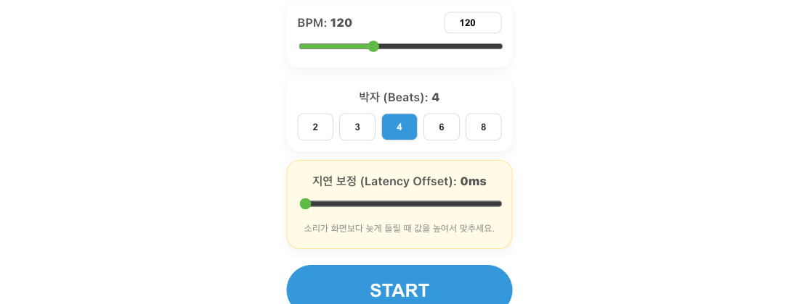

# Web Sync Metronome

브라우저에서 동작하는 실시간 동기화 메트로놈입니다.  
호스트가 만든 룸(Room)에 멤버가 참여하면, 호스트의 BPM·박자·재생 상태가 다른 기기에도 같이 반영되어 여러 기기가 같은 설정으로 연습할 수 있습니다.

## 주요 기능

### 기본 메트로놈

BPM은 `20 ~ 300`까지, 박자는 `2, 3, 4, 6, 8` 중에서 고를 수 있습니다. 강박은 더 높은 음, 약박은 더 낮은 음으로 구분됩니다.

### 실시간 룸 동기화

`SHARE`로 룸을 만들면 호스트가 되고, 표시되는 코드를 다른 기기에서 `JOIN`에 입력하면 멤버로 참여합니다. 호스트가 바꾼 BPM·박자·재생/정지가 멤버에게 전달됩니다.

### 시각 비주얼라이저

재생 중에는 현재 박자에 맞춰 번호 원이 강조되며, 박자를 한눈에 따라가기 쉽습니다.

### 로컬 저장

BPM·박자 값은 같은 브라우저에 저장되어, 다음에 열 때 이전 설정을 이어서 쓸 수 있습니다.

